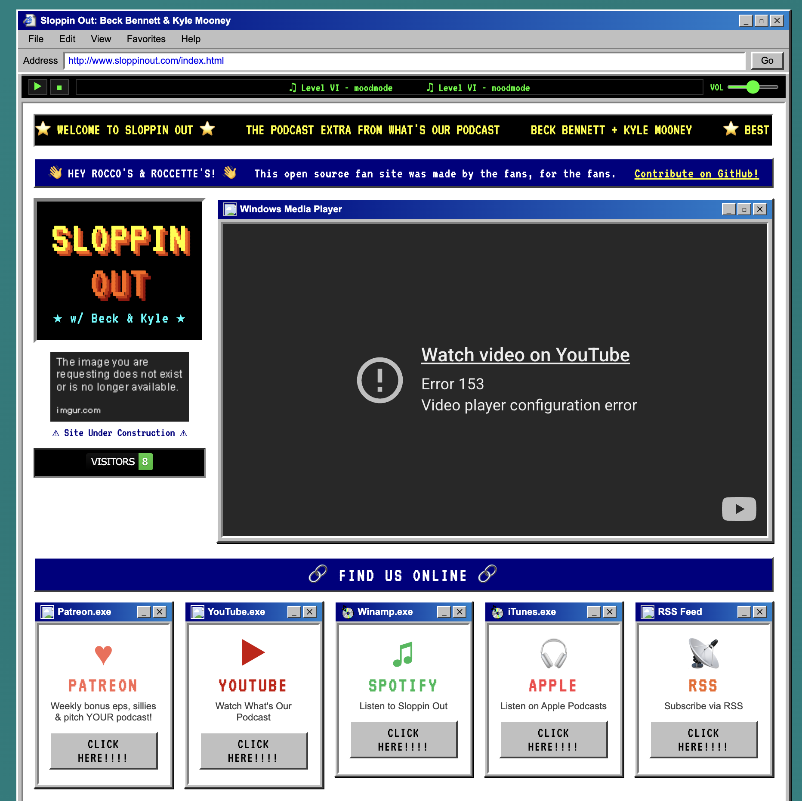
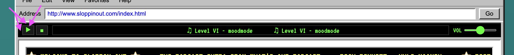

# sloppinout.com

> An unofficial, open source fan site for **Sloppin Out** — the Patreon bonus content from **What's Our Podcast** with Beck Bennett and Kyle Mooney, a [Headgum](https://headgum.com/) podcast.

Made by the fans (Rocco's & Roccette's), for the fans.



---

## What's Our Podcast?

**What's Our Podcast** is hosted by Beck Bennett and Kyle Mooney. **Sloppin Out** is the exclusive bonus content available to Patreon subscribers — weekly bonus episodes, sillies, and the chance to pitch your own podcast idea on **What's YOUR Podcast**.

- [Patreon](https://www.patreon.com/cw/WhatsOurPodcast)
- [YouTube](https://www.youtube.com/@whatsourpodcast)
- [Spotify](https://open.spotify.com/show/6Lbre2Vjq8Ym9qe0GKfBAq)
- [Apple Podcasts](https://itunes.apple.com/us/podcast/id1834487732)
- [RSS](https://rss.art19.com/whats-our-podcast)

---

## Features

- Windows 95 / Internet Explorer retro aesthetic
- Winamp-style music player with royalty-free 8-bit theme



- Live visitor counter
- Links to all official platforms
- GitHub Actions CI/CD — deploys to GitHub Pages on every push to `main`
- Security-checked on every PR (11 automated checks)

---

## Running Locally

No build step. Just open `index.html` in a browser:

```bash
# with Python
python3 -m http.server 8080

# or with Node
npx serve .
```

Then visit `http://localhost:8080`.

> Note: The YouTube embed and visitor counter require a live HTTP server — they won't work over `file://`.

---

## Running Tests

```bash
npm install
npm test
```

Tests run automatically on every pull request via GitHub Actions. They include:

- HTML validation (`html-validate`)
- Security checks (inline handlers, mixed content, XSS vectors, missing `rel` attributes, etc.)

---

## Contributing

This site is open source and contributions are welcome from all Rocco's and Roccette's!

1. Fork the repo
2. Create a branch (`git checkout -b my-feature`)
3. Make your changes
4. Run `npm test` to make sure everything passes
5. Open a pull request

**[github.com/binbashburns/sloppinout.com](https://github.com/binbashburns/sloppinout.com)**

---

## Credits & Legal

This is an **unofficial** fan site. All podcast content, branding, and rights belong to [Headgum](https://headgum.com/).

- Background music: "Level VI" by [moodmode](https://pixabay.com/users/moodmode-33139253/) via [Pixabay](https://pixabay.com/music/video-games-level-vi-274939/) (Pixabay License)
- Retro UI icons via [alexmeub's Win98 Icons](https://win98icons.alexmeub.com/)
- Fonts: [VT323](https://fonts.google.com/specimen/VT323) via Google Fonts

---

*Best viewed in Netscape Navigator 4.0 at 800x600.*
